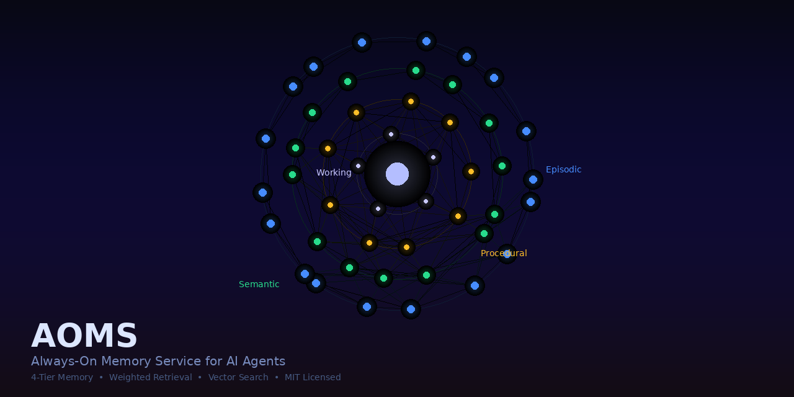

<p align="center">
  
</p>

<h1 align="center">AOMS — Always-On Memory Service</h1>

<p align="center">
  Persistent 4-tier memory for AI agents. Weighted retrieval. Vector search. Progressive disclosure.
  <br/>
  <strong>Your agent remembers what it learned. Across sessions. Forever.</strong>
</p>

<p align="center">
  <a href="https://clawhub.ai/DhawalA4/aoms"></a>
  <a href="https://opensource.org/licenses/MIT"></a>
  <a href="https://python.org"></a>
</p>

---

## Why AOMS?

Most AI agents forget everything between sessions. The few that don't use flat files that grow forever with no ranking, no decay, no structure.

AOMS models how memory actually works:

- **Important things surface first** — weighted retrieval with reinforcement learning
- **Old things naturally fade** — time-based weight decay
- **Similar things consolidate** — automatic clustering and summarization
- **Context stays efficient** — progressive disclosure (L0/L1/L2) gives 98% token reduction

Running on a live autonomous agent stack with **63,000+ memories** and counting.

## Quick Start

```bash
# Install
git clone https://github.com/dhawalc/cortex-mem.git
cd cortex-mem
pip install -e .

# Start
cortex-mem start --daemon

# Check health
cortex-mem status

# Search memory
cortex-mem search "deployment"
```

Or via Docker:

```bash
docker build -t aoms .
docker run -p 9100:9100 -v aoms-data:/app/modules aoms
```

API docs at `http://localhost:9100/docs`.

## Memory Tiers

| Tier | Stores | Example |
|------|--------|---------|
| **Episodic** | Experiences, decisions, failures | "Deployed v2 — rollback needed due to missing migration" |
| **Semantic** | Facts, relations, knowledge graphs | "Project uses pnpm, not npm" |
| **Procedural** | Skills, patterns, workflows | "To deploy: run migrations first, then build, then push" |
| **Working** | Active tasks, current context | "Currently debugging auth token refresh" |

## Core API

```bash
# Write a memory
curl -X POST http://localhost:9100/memory/episodic \
  -H "Content-Type: application/json" \
  -d '{"type": "experience", "payload": {"title": "Fixed auth bug", "outcome": "Token refresh was missing retry logic"}, "weight": 1.3}'

# Search
curl -X POST http://localhost:9100/memory/search \
  -d '{"query": "auth", "limit": 5}'

# Agent recall (formatted context for prompt injection)
curl -X POST http://localhost:9100/recall \
  -d '{"task": "deploy the API", "token_budget": 500, "format": "markdown"}'

# Reinforce useful memory
curl -X POST http://localhost:9100/memory/weight \
  -d '{"entry_id": "abc123", "tier": "episodic", "task_score": 0.9}'

# Progressive disclosure query
curl -X POST http://localhost:9100/cortex/query \
  -d '{"query": "deployment process", "token_budget": 1000}'
```

## Full API

| Endpoint | Method | Description |
|----------|--------|-------------|
| `/memory/{tier}` | POST | Write a memory entry |
| `/memory/search` | POST | Keyword search with weighted scoring |
| `/memory/semantic-search` | POST | Vector search (requires Ollama) |
| `/memory/weight` | POST | Reinforce/decay entry weight |
| `/memory/decay` | POST | Time-based weight decay |
| `/memory/consolidate` | POST | Merge similar old memories |
| `/memory/deduplicate` | POST | Find and merge duplicates |
| `/recall` | POST | Agent context recall (formatted) |
| `/cortex/query` | POST | Smart L0/L1/L2 query |
| `/cortex/ingest` | POST | Ingest document with tier generation |
| `/entities/extract` | POST | Extract entities from text |
| `/stats` | GET | Memory analytics |
| `/health` | GET | Service health |

## Agent Integration

### MCP (AOMS v2)

Run the FastMCP adapter over stdio with:

```bash
python -m aoms.adapters.mcp_server
```

The server binds identity once at process startup from `AOMS_AGENT_ID` and
`AOMS_WORKSPACE`; identity is never accepted as a tool parameter. For a local
single-user setup, either variable may be omitted and defaults to `default`.
Set `AOMS_DATA_DIR` to choose the v2 SQLite fixture/data directory and
`AOMS_EMBEDDING_PROVIDER=none` to disable embeddings.

### OpenClaw

```bash
clawhub install aoms
```

AOMS auto-configures when installed alongside [OpenClaw](https://openclaw.ai). The pip package includes an OpenClaw plugin that starts the service, configures the memory backend, and migrates existing workspace memory.

### Any Agent (HTTP)

```python
import httpx

# Recall relevant context at session start
resp = httpx.post("http://localhost:9100/recall", json={
    "task": "working on auth module",
    "token_budget": 500,
    "format": "markdown"
})
context = resp.json()["context"]

# Log what you learned
httpx.post("http://localhost:9100/memory/episodic", json={
    "type": "experience",
    "payload": {"title": "pnpm not npm", "outcome": "Project uses pnpm workspaces"},
    "weight": 1.5
})
```

## Architecture

```
cortex-mem/
├── service/             # FastAPI application
│   ├── api.py           # All endpoints
│   ├── storage.py       # JSONL engine + weighted scoring
│   └── models.py        # Pydantic schemas
├── cortex/              # Progressive disclosure engine
│   ├── tiered_retrieval.py  # L0/L1/L2 query with auto-escalation
│   └── tier_generator.py    # Document ingestion + summary generation
├── cortex_mem/          # Python package + CLI
│   ├── cli.py           # Click CLI
│   └── openclaw_plugin.py   # Auto-integration
├── modules/             # JSONL memory data
│   └── memory/
│       ├── episodic/
│       ├── semantic/
│       └── procedural/
├── Dockerfile
├── pyproject.toml
└── run.py
```

## CLI

```
cortex-mem start [--port 9100] [--daemon]   Start service
cortex-mem stop                              Stop service
cortex-mem status                            Health check
cortex-mem search QUERY [--limit 5]          Search memory
cortex-mem migrate SOURCE                    Import workspace data
```

## Configuration

```yaml
# service/config.yaml
service:
  port: 9100
  host: localhost      # 0.0.0.0 for Docker

weights:
  decay_rate: 0.995    # Daily decay multiplier
  min_weight: 0.1
  max_weight: 5.0
```

## Requirements

- Python 3.10+
- Optional: [Ollama](https://ollama.ai) with `nomic-embed-text` for vector search
- Optional: [Ollama](https://ollama.ai) with any chat model for consolidation/entity extraction

## License

MIT
